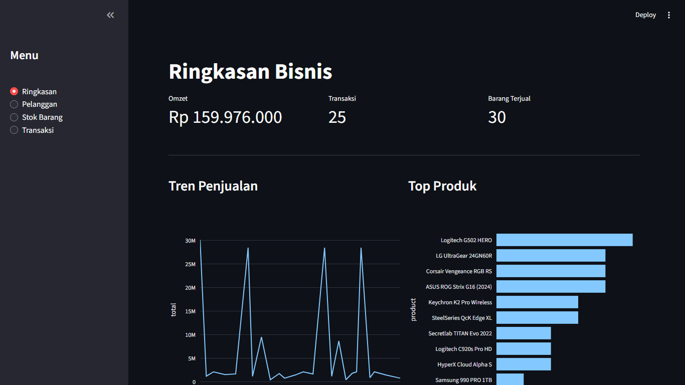
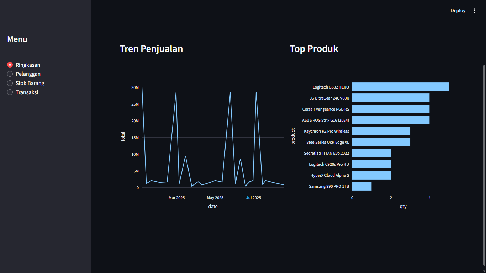
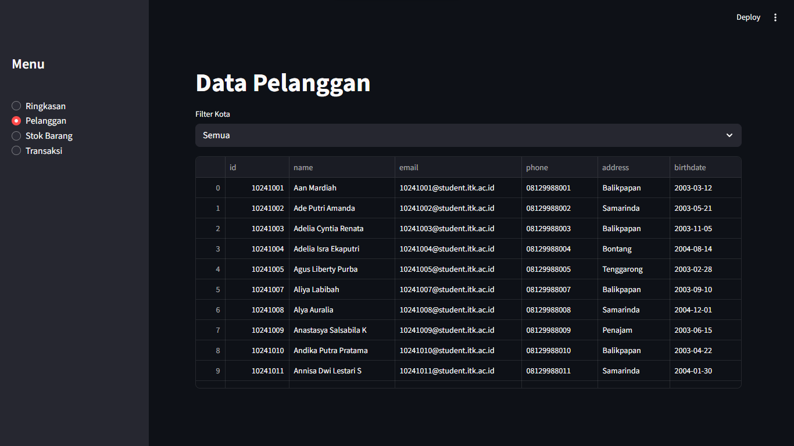
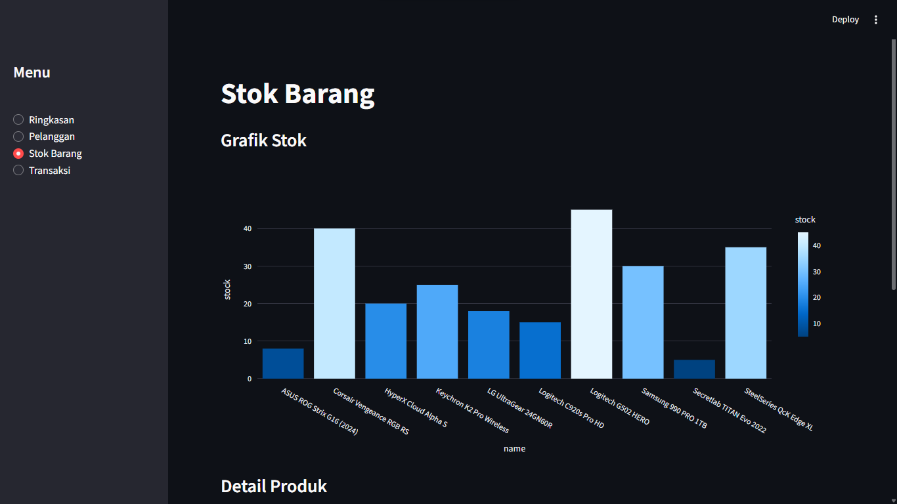
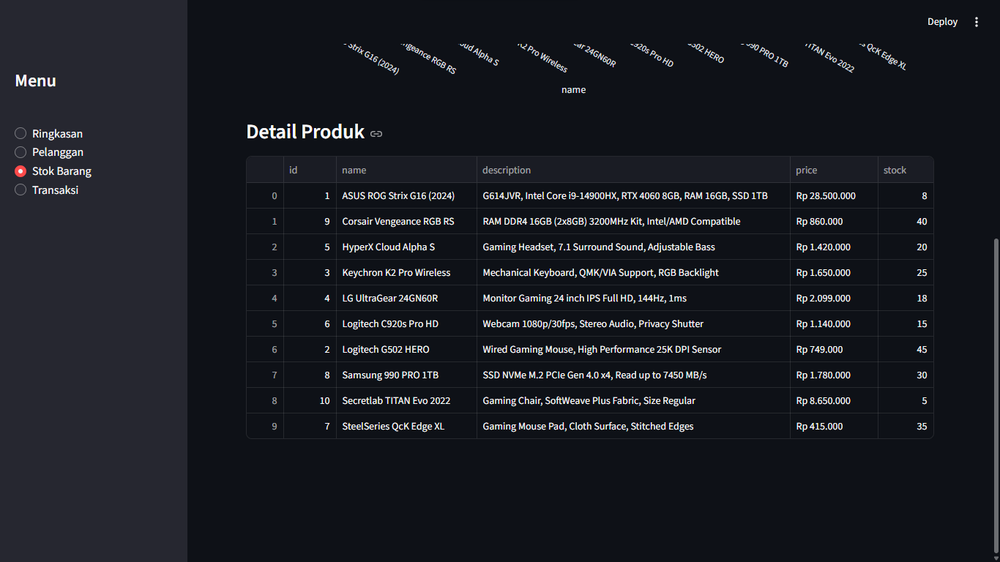
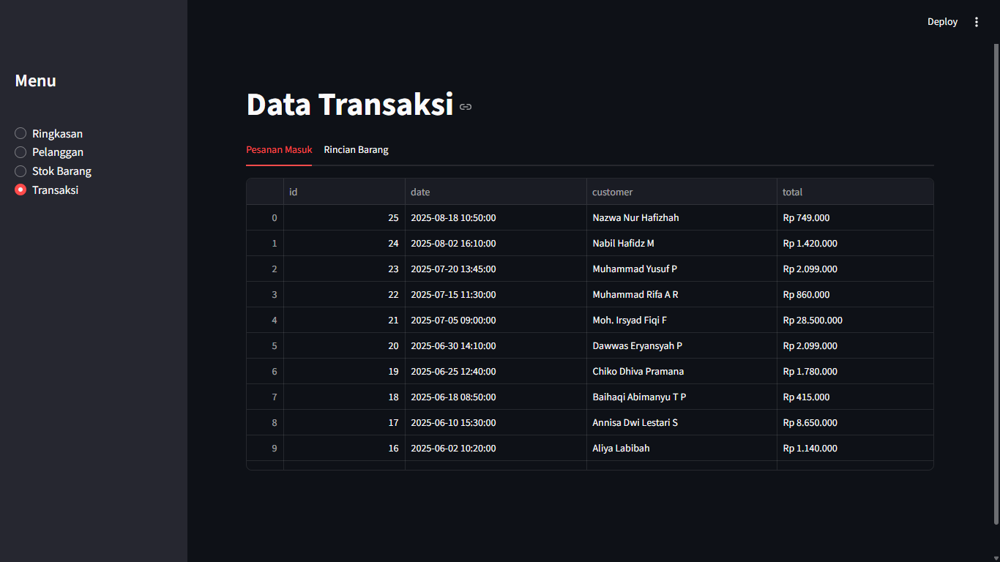
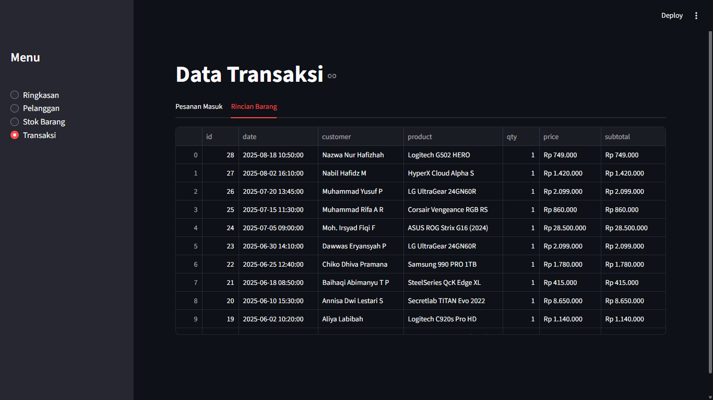

# Laporan Praktikum Basis Data - Tugas 5
## Implementasi Dashboard Visualisasi Data dengan Streamlit & MySQL

**Nama**        : Devin Raditya Pratama
**NIM**         : 10241021
**Mata Kuliah** : Basis Data A
**Tugas**       : Tugas 5 (Visualisasi Data)

---

### 1. Full Code

#### A. Kode Python (`main.py`)

Berikut adalah kode lengkap yang digunakan dalam pembangunan aplikasi Dashboard Penjualan.
```py
import streamlit as st
import pandas as pd
import plotly.express as px
from config import get_customers, get_products, get_orders, get_order_details

st.set_page_config(page_title="Sales Dashboard", layout="wide")

def format_idr(nilai):
    return f"Rp {nilai:,.0f}".replace(",", ".")

def load_data():
    customers = pd.DataFrame(get_customers(), columns=['id', 'name', 'email', 'phone', 'address', 'birthdate'])
    products = pd.DataFrame(get_products(), columns=['id', 'name', 'description', 'price', 'stock'])
    products['price'] = products['price'].astype(float)
    products['stock'] = products['stock'].astype(int)
    orders = pd.DataFrame(get_orders(), columns=['id', 'date', 'customer', 'total'])
    orders['total'] = orders['total'].astype(float)
    orders['date'] = pd.to_datetime(orders['date'])
    details = pd.DataFrame(get_order_details(), columns=['id', 'date', 'customer', 'product', 'qty', 'price', 'subtotal'])
    details['qty'] = details['qty'].astype(int)
    details['price'] = details['price'].astype(float)
    details['subtotal'] = details['subtotal'].astype(float)
    return customers, products, orders, details

try:
    df_cust, df_prod, df_ord, df_det = load_data()
except Exception as e:
    st.error(e)
    st.stop()

st.sidebar.title("Menu")
page = st.sidebar.radio("", ["Ringkasan", "Pelanggan", "Stok Barang", "Transaksi"])

if page == "Ringkasan":
    st.title("Ringkasan Bisnis")
    c1, c2, c3 = st.columns(3)
    c1.metric("Omzet", format_idr(df_ord['total'].sum()))
    c2.metric("Transaksi", df_ord.shape[0])
    c3.metric("Barang Terjual", df_det['qty'].sum())
    st.divider()
    col_grafik1, col_grafik2 = st.columns(2)
    with col_grafik1:
        st.subheader("Tren Penjualan")
        daily = df_ord.groupby(df_ord['date'].dt.date)['total'].sum().reset_index()
        fig = px.line(daily, x='date', y='total')
        st.plotly_chart(fig, use_container_width=True)
    with col_grafik2:
        st.subheader("Top Produk")
        top = df_det.groupby('product')['qty'].sum().reset_index().sort_values(by='qty', ascending=True)
        fig = px.bar(top, x='qty', y='product', orientation='h')
        st.plotly_chart(fig, use_container_width=True)

elif page == "Pelanggan":
    st.title("Data Pelanggan")
    kota = st.selectbox("Filter Kota", ["Semua"] + list(df_cust['address'].unique()))
    if kota != "Semua":
        view = df_cust[df_cust['address'] == kota]
    else:
        view = df_cust
    st.dataframe(view, use_container_width=True)

elif page == "Stok Barang":
    st.title("Stok Barang")
    st.subheader("Grafik Stok")
    fig = px.bar(df_prod, x='name', y='stock', color='stock')
    st.plotly_chart(fig, use_container_width=True)
    st.subheader("Detail Produk")
    df_prod_show = df_prod.copy()
    df_prod_show['price'] = df_prod_show['price'].apply(format_idr)
    st.dataframe(df_prod_show, use_container_width=True)

elif page == "Transaksi":
    st.title("Data Transaksi")
    tab1, tab2 = st.tabs(["Pesanan Masuk", "Rincian Barang"])
    with tab1:
        df_ord_show = df_ord.copy()
        df_ord_show['total'] = df_ord_show['total'].apply(format_idr)
        st.dataframe(df_ord_show, use_container_width=True)
    with tab2:
        df_det_show = df_det.copy()
        df_det_show['price'] = df_det_show['price'].apply(format_idr)
        df_det_show['subtotal'] = df_det_show['subtotal'].apply(format_idr)
        st.dataframe(df_det_show, use_container_width=True)
```

#### B. Database SQL (`sales_db.sql`)
Script ini mencakup DDL (pembuatan tabel) dan DML (pengisian data dummy).

```sql
-- phpMyAdmin SQL Dump
-- version 5.2.0
-- https://www.phpmyadmin.net/
--
-- Host: localhost:3306
-- Generation Time: Nov 20, 2025 at 04:52 AM
-- Server version: 8.0.30
-- PHP Version: 8.2.28

SET SQL_MODE = "NO_AUTO_VALUE_ON_ZERO";
START TRANSACTION;
SET time_zone = "+00:00";


/*!40101 SET @OLD_CHARACTER_SET_CLIENT=@@CHARACTER_SET_CLIENT */;
/*!40101 SET @OLD_CHARACTER_SET_RESULTS=@@CHARACTER_SET_RESULTS */;
/*!40101 SET @OLD_COLLATION_CONNECTION=@@COLLATION_CONNECTION */;
/*!40101 SET NAMES utf8mb4 */;

--
-- Database: `sales_db`
--

-- --------------------------------------------------------

--
-- Table structure for table `customers`
--

CREATE TABLE `customers` (
  `customer_id` int NOT NULL,
  `name` varchar(100) NOT NULL,
  `email` varchar(100) NOT NULL,
  `phone` varchar(15) DEFAULT NULL,
  `address` text,
  `birthdate` date DEFAULT NULL
) ENGINE=InnoDB DEFAULT CHARSET=utf8mb4 COLLATE=utf8mb4_0900_ai_ci;

--
-- Dumping data for table `customers`
--

INSERT INTO `customers` (`customer_id`, `name`, `email`, `phone`, `address`, `birthdate`) VALUES
(10241001, 'Aan Mardiah', '10241001@student.itk.ac.id', '08129988001', 'Balikpapan', '2003-03-12'),
(10241002, 'Ade Putri Amanda', '10241002@student.itk.ac.id', '08129988002', 'Samarinda', '2003-05-21'),
(10241003, 'Adelia Cyntia Renata', '10241003@student.itk.ac.id', '08129988003', 'Balikpapan', '2003-11-05'),
(10241004, 'Adelia Isra Ekaputri', '10241004@student.itk.ac.id', '08129988004', 'Bontang', '2004-08-14'),
(10241005, 'Agus Liberty Purba', '10241005@student.itk.ac.id', '08129988005', 'Tenggarong', '2003-02-28'),
(10241007, 'Aliya Labibah', '10241007@student.itk.ac.id', '08129988007', 'Balikpapan', '2003-09-10'),
(10241008, 'Alya Auralia', '10241008@student.itk.ac.id', '08129988008', 'Samarinda', '2004-12-01'),
(10241009, 'Anastasya Salsabila K', '10241009@student.itk.ac.id', '08129988009', 'Penajam', '2003-06-15'),
(10241010, 'Andika Putra Pratama', '10241010@student.itk.ac.id', '08129988010', 'Balikpapan', '2003-04-22'),
(10241011, 'Annisa Dwi Lestari S', '10241011@student.itk.ac.id', '08129988011', 'Samarinda', '2004-01-30'),
(10241013, 'Armansyah', '10241013@student.itk.ac.id', '08129988013', 'Bontang', '2003-07-19'),
(10241014, 'Baihaqi Abimanyu T P', '10241014@student.itk.ac.id', '08129988014', 'Tenggarong', '2003-10-11'),
(10241015, 'Bella Alviana', '10241015@student.itk.ac.id', '08129988015', 'Balikpapan', '2004-05-05'),
(10241016, 'Calvin Hidayat W', '10241016@student.itk.ac.id', '08129988016', 'Samarinda', '2003-08-25'),
(10241017, 'Chiko Dhiva Pramana', '10241017@student.itk.ac.id', '08129988017', 'Penajam', '2003-03-03'),
(10241018, 'Clara Uenike Meylan L', '10241018@student.itk.ac.id', '08129988018', 'Balikpapan', '2004-11-17'),
(10241019, 'Dawwas Eryansyah P', '10241019@student.itk.ac.id', '08129988019', 'Samarinda', '2003-09-29'),
(10241020, 'Desta Rifqi Aunur R', '10241020@student.itk.ac.id', '08129988020', 'Bontang', '2003-02-14'),
(10241021, 'Devin Raditya Pratama', '10241021@student.itk.ac.id', '08129988021', 'Balikpapan', '2003-06-08'),
(10241022, 'Devina Dian Saputri', '10241022@student.itk.ac.id', '08129988022', 'Tenggarong', '2004-04-12'),
(10241023, 'Dewi Bulan Purnama', '10241023@student.itk.ac.id', '08129988023', 'Samarinda', '2003-10-20'),
(10241025, 'Eagan Ferdian', '10241025@student.itk.ac.id', '08129988025', 'Balikpapan', '2003-12-25'),
(10241026, 'Elsya Nur Aulia H', '10241026@student.itk.ac.id', '08129988026', 'Penajam', '2004-01-09'),
(10241027, 'Fabyo Nathanael S', '10241027@student.itk.ac.id', '08129988027', 'Samarinda', '2003-07-31'),
(10241028, 'Falih Dzakwan', '10241028@student.itk.ac.id', '08129988028', 'Bontang', '2003-08-16'),
(10241029, 'Fariz Daffa Abbiyu R', '10241029@student.itk.ac.id', '08129988029', 'Balikpapan', '2004-03-05'),
(10241030, 'Fatika Rizki Syahada', '10241030@student.itk.ac.id', '08129988030', 'Tenggarong', '2003-11-28'),
(10241031, 'Feniria', '10241031@student.itk.ac.id', '08129988031', 'Samarinda', '2004-05-14'),
(10241033, 'Fitriyansyah W', '10241033@student.itk.ac.id', '08129988033', 'Balikpapan', '2003-09-02'),
(10241035, 'Hamzah Wiranata', '10241035@student.itk.ac.id', '08129988035', 'Penajam', '2003-06-21'),
(10241036, 'Indriani Anwar', '10241036@student.itk.ac.id', '08129988036', 'Bontang', '2004-02-10'),
(10241037, 'Jeshua Austin D', '10241037@student.itk.ac.id', '08129988037', 'Samarinda', '2003-12-18'),
(10241038, 'Laudya Aprilia K', '10241038@student.itk.ac.id', '08129988038', 'Balikpapan', '2003-04-04'),
(10241039, 'Linggar Pramudya', '10241039@student.itk.ac.id', '08129988039', 'Tenggarong', '2004-10-30'),
(10241040, 'Marchelino Senduk K', '10241040@student.itk.ac.id', '08129988040', 'Samarinda', '2003-01-22'),
(10241041, 'Melodiva Rosananda', '10241041@student.itk.ac.id', '08129988041', 'Balikpapan', '2004-08-08'),
(10241042, 'Moh. Irsyad Fiqi F', '10241042@student.itk.ac.id', '08129988042', 'Penajam', '2003-11-11'),
(10241043, 'Muchammad Maulana', '10241043@student.itk.ac.id', '08129988043', 'Bontang', '2004-05-25'),
(10241044, 'Muhammad Arif S', '10241044@student.itk.ac.id', '08129988044', 'Samarinda', '2003-03-17'),
(10241045, 'Muhammad Daffa N P', '10241045@student.itk.ac.id', '08129988045', 'Balikpapan', '2004-07-07'),
(10241046, 'Muhammad Farin M S', '10241046@student.itk.ac.id', '08129988046', 'Tenggarong', '2003-09-14'),
(10241047, 'Muhammad Farras K', '10241047@student.itk.ac.id', '08129988047', 'Samarinda', '2004-12-02'),
(10241049, 'Muhammad Ikhsyan', '10241049@student.itk.ac.id', '08129988049', 'Balikpapan', '2003-02-22'),
(10241050, 'Muhammad Rifa A R', '10241050@student.itk.ac.id', '08129988050', 'Penajam', '2004-06-06'),
(10241051, 'Muhammad Syahid R', '10241051@student.itk.ac.id', '08129988051', 'Bontang', '2003-10-15'),
(10241052, 'Muhammad Yuspa A', '10241052@student.itk.ac.id', '08129988052', 'Samarinda', '2004-04-09'),
(10241053, 'Muhammad Yusuf P', '10241053@student.itk.ac.id', '08129988053', 'Balikpapan', '2003-01-01'),
(10241054, 'Muhammad Zaldy S F', '10241054@student.itk.ac.id', '08129988054', 'Tenggarong', '2004-09-23'),
(10241055, 'Nabil Hafidz M', '10241055@student.itk.ac.id', '08129988055', 'Samarinda', '2003-05-18'),
(10241056, 'Nazwa Nur Hafizhah', '10241056@student.itk.ac.id', '08129988056', 'Balikpapan', '2004-11-12');

-- --------------------------------------------------------

--
-- Table structure for table `orders`
--

CREATE TABLE `orders` (
  `order_id` int NOT NULL,
  `customer_id` int NOT NULL,
  `order_date` datetime DEFAULT CURRENT_TIMESTAMP,
  `total_amount` decimal(15,2) NOT NULL
) ENGINE=InnoDB DEFAULT CHARSET=utf8mb4 COLLATE=utf8mb4_0900_ai_ci;

--
-- Dumping data for table `orders`
--

INSERT INTO `orders` (`order_id`, `customer_id`, `order_date`, `total_amount`) VALUES
(1, 10241001, '2025-01-05 10:00:00', '30150000.00'),
(2, 10241003, '2025-01-12 14:30:00', '1164000.00'),
(3, 10241005, '2025-01-20 09:15:00', '2099000.00'),
(4, 10241008, '2025-02-02 16:45:00', '1498000.00'),
(5, 10241010, '2025-02-14 11:20:00', '1650000.00'),
(6, 10241015, '2025-02-28 13:00:00', '28500000.00'),
(7, 10241020, '2025-03-05 10:30:00', '1140000.00'),
(8, 10241022, '2025-03-15 15:10:00', '9510000.00'),
(9, 10241025, '2025-03-25 08:45:00', '415000.00'),
(10, 10241028, '2025-04-04 12:00:00', '1720000.00'),
(11, 10241031, '2025-04-10 14:50:00', '749000.00'),
(12, 10241033, '2025-04-22 09:30:00', '1420000.00'),
(13, 10241035, '2025-05-01 16:15:00', '2099000.00'),
(14, 10241002, '2025-05-12 11:00:00', '1650000.00'),
(15, 10241004, '2025-05-25 13:45:00', '28500000.00'),
(16, 10241007, '2025-06-02 10:20:00', '1140000.00'),
(17, 10241011, '2025-06-10 15:30:00', '8650000.00'),
(18, 10241014, '2025-06-18 08:50:00', '415000.00'),
(19, 10241017, '2025-06-25 12:40:00', '1780000.00'),
(20, 10241019, '2025-06-30 14:10:00', '2099000.00'),
(21, 10241042, '2025-07-05 09:00:00', '28500000.00'),
(22, 10241050, '2025-07-15 11:30:00', '860000.00'),
(23, 10241053, '2025-07-20 13:45:00', '2099000.00'),
(24, 10241055, '2025-08-02 16:10:00', '1420000.00'),
(25, 10241056, '2025-08-18 10:50:00', '749000.00');

-- --------------------------------------------------------

--
-- Table structure for table `order_details`
--

CREATE TABLE `order_details` (
  `order_detail_id` int NOT NULL,
  `order_id` int NOT NULL,
  `product_id` int NOT NULL,
  `quantity` int NOT NULL,
  `price` decimal(15,2) NOT NULL,
  `subtotal` decimal(15,2) GENERATED ALWAYS AS ((`quantity` * `price`)) STORED
) ENGINE=InnoDB DEFAULT CHARSET=utf8mb4 COLLATE=utf8mb4_0900_ai_ci;

--
-- Dumping data for table `order_details`
--

INSERT INTO `order_details` (`order_detail_id`, `order_id`, `product_id`, `quantity`, `price`) VALUES
(1, 1, 1, 1, '28500000.00'),
(2, 1, 3, 1, '1650000.00'),
(3, 2, 2, 1, '749000.00'),
(4, 2, 7, 1, '415000.00'),
(5, 3, 4, 1, '2099000.00'),
(6, 4, 2, 2, '749000.00'),
(7, 5, 3, 1, '1650000.00'),
(8, 6, 1, 1, '28500000.00'),
(9, 7, 6, 1, '1140000.00'),
(10, 8, 9, 1, '860000.00'),
(11, 8, 10, 1, '8650000.00'),
(12, 9, 7, 1, '415000.00'),
(13, 10, 9, 2, '860000.00'),
(14, 11, 2, 1, '749000.00'),
(15, 12, 5, 1, '1420000.00'),
(16, 13, 4, 1, '2099000.00'),
(17, 14, 3, 1, '1650000.00'),
(18, 15, 1, 1, '28500000.00'),
(19, 16, 6, 1, '1140000.00'),
(20, 17, 10, 1, '8650000.00'),
(21, 18, 7, 1, '415000.00'),
(22, 19, 8, 1, '1780000.00'),
(23, 20, 4, 1, '2099000.00'),
(24, 21, 1, 1, '28500000.00'),
(25, 22, 9, 1, '860000.00'),
(26, 23, 4, 1, '2099000.00'),
(27, 24, 5, 1, '1420000.00'),
(28, 25, 2, 1, '749000.00');

-- --------------------------------------------------------

--
-- Table structure for table `products`
--

CREATE TABLE `products` (
  `product_id` int NOT NULL,
  `name` varchar(100) NOT NULL,
  `description` text,
  `price` decimal(15,2) NOT NULL,
  `stock` int NOT NULL
) ENGINE=InnoDB DEFAULT CHARSET=utf8mb4 COLLATE=utf8mb4_0900_ai_ci;

--
-- Dumping data for table `products`
--

INSERT INTO `products` (`product_id`, `name`, `description`, `price`, `stock`) VALUES
(1, 'ASUS ROG Strix G16 (2024)', 'G614JVR, Intel Core i9-14900HX, RTX 4060 8GB, RAM 16GB, SSD 1TB', '28500000.00', 8),
(2, 'Logitech G502 HERO', 'Wired Gaming Mouse, High Performance 25K DPI Sensor', '749000.00', 45),
(3, 'Keychron K2 Pro Wireless', 'Mechanical Keyboard, QMK/VIA Support, RGB Backlight', '1650000.00', 25),
(4, 'LG UltraGear 24GN60R', 'Monitor Gaming 24 inch IPS Full HD, 144Hz, 1ms', '2099000.00', 18),
(5, 'HyperX Cloud Alpha S', 'Gaming Headset, 7.1 Surround Sound, Adjustable Bass', '1420000.00', 20),
(6, 'Logitech C920s Pro HD', 'Webcam 1080p/30fps, Stereo Audio, Privacy Shutter', '1140000.00', 15),
(7, 'SteelSeries QcK Edge XL', 'Gaming Mouse Pad, Cloth Surface, Stitched Edges', '415000.00', 35),
(8, 'Samsung 990 PRO 1TB', 'SSD NVMe M.2 PCIe Gen 4.0 x4, Read up to 7450 MB/s', '1780000.00', 30),
(9, 'Corsair Vengeance RGB RS', 'RAM DDR4 16GB (2x8GB) 3200MHz Kit, Intel/AMD Compatible', '860000.00', 40),
(10, 'Secretlab TITAN Evo 2022', 'Gaming Chair, SoftWeave Plus Fabric, Size Regular', '8650000.00', 5);

--
-- Indexes for dumped tables
--

--
-- Indexes for table `customers`
--
ALTER TABLE `customers`
  ADD PRIMARY KEY (`customer_id`),
  ADD UNIQUE KEY `email` (`email`);

--
-- Indexes for table `orders`
--
ALTER TABLE `orders`
  ADD PRIMARY KEY (`order_id`),
  ADD KEY `customer_id` (`customer_id`);

--
-- Indexes for table `order_details`
--
ALTER TABLE `order_details`
  ADD PRIMARY KEY (`order_detail_id`),
  ADD KEY `order_id` (`order_id`),
  ADD KEY `product_id` (`product_id`);

--
-- Indexes for table `products`
--
ALTER TABLE `products`
  ADD PRIMARY KEY (`product_id`);

--
-- AUTO_INCREMENT for dumped tables
--

--
-- AUTO_INCREMENT for table `orders`
--
ALTER TABLE `orders`
  MODIFY `order_id` int NOT NULL AUTO_INCREMENT, AUTO_INCREMENT=26;

--
-- AUTO_INCREMENT for table `order_details`
--
ALTER TABLE `order_details`
  MODIFY `order_detail_id` int NOT NULL AUTO_INCREMENT, AUTO_INCREMENT=29;

--
-- AUTO_INCREMENT for table `products`
--
ALTER TABLE `products`
  MODIFY `product_id` int NOT NULL AUTO_INCREMENT, AUTO_INCREMENT=11;

--
-- Constraints for dumped tables
--

--
-- Constraints for table `orders`
--
ALTER TABLE `orders`
  ADD CONSTRAINT `orders_ibfk_1` FOREIGN KEY (`customer_id`) REFERENCES `customers` (`customer_id`) ON DELETE CASCADE;

--
-- Constraints for table `order_details`
--
ALTER TABLE `order_details`
  ADD CONSTRAINT `order_details_ibfk_1` FOREIGN KEY (`order_id`) REFERENCES `orders` (`order_id`) ON DELETE CASCADE,
  ADD CONSTRAINT `order_details_ibfk_2` FOREIGN KEY (`product_id`) REFERENCES `products` (`product_id`) ON DELETE CASCADE;
COMMIT;

/*!40101 SET CHARACTER_SET_CLIENT=@OLD_CHARACTER_SET_CLIENT */;
/*!40101 SET CHARACTER_SET_RESULTS=@OLD_CHARACTER_SET_RESULTS */;
/*!40101 SET COLLATION_CONNECTION=@OLD_COLLATION_CONNECTION */;
```

### 2. Penjelasan Code

---

A.
```py
import streamlit as st
import pandas as pd
import plotly.express as px
from config import get_customers, get_products, get_orders, get_order_details

st.set_page_config(page_title="Sales Dashboard", layout="wide")
```
Bagian ini memuat semua librari yang bakal dipakai (Streamlit untuk web, Pandas untuk data, Plotly untuk grafik desain) dan mengatur agar halaman dashboard tampil penuh (mode wide).

---

B.
```py
def format_idr(nilai):
    return f"Rp {nilai:,.0f}".replace(",", ".")
```
Potongan ini berfungsi sebagai bantuan untuk mengubah angka mentah menjadi format mata uang Indonesia agar tabel lebih enak dibaca.

---

C.
```py
def load_data():
    customers = pd.DataFrame(get_customers(), columns=['id', 'name', 'email', 'phone', 'address', 'birthdate'])
    products = pd.DataFrame(get_products(), columns=['id', 'name', 'description', 'price', 'stock'])
    products['price'] = products['price'].astype(float)
    products['stock'] = products['stock'].astype(int)
    orders = pd.DataFrame(get_orders(), columns=['id', 'date', 'customer', 'total'])
    orders['total'] = orders['total'].astype(float)
    orders['date'] = pd.to_datetime(orders['date'])
    details = pd.DataFrame(get_order_details(), columns=['id', 'date', 'customer', 'product', 'qty', 'price', 'subtotal'])
    details['qty'] = details['qty'].astype(int)
    details['price'] = details['price'].astype(float)
    details['subtotal'] = details['subtotal'].astype(float)
    return customers, products, orders, details
```
Mengambil data dari database, lalu memperbaiki tipe datanya yaitu :
- kolom harga diubah jadi angka desimal.
- stok jadi bilangan bulat.
- tanggal jadi format waktu agar bisa diolah grafik.

---

D.
```py
try:
    df_cust, df_prod, df_ord, df_det = load_data()
except Exception as e:
    st.error(e)
    st.stop()
```
Menjalankan fungsi `load_data` dengan pengaman. Kalau koneksi database gagal, aplikasi akan menampilkan pesan error yang jelas dan berhenti, bukannya crash atau layar putih.

---

E.
```py
st.sidebar.title("Menu")
page = st.sidebar.radio("", ["Ringkasan", "Pelanggan", "Stok Barang", "Transaksi"])
```
Membuat menu di sidebar menggunakan tombol pilihan. User bisa memilih halaman mana yang akan ditampilkan.

---

F.
```py
if page == "Ringkasan":
    st.title("Ringkasan Bisnis")
    c1, c2, c3 = st.columns(3)
    c1.metric("Omzet", format_idr(df_ord['total'].sum()))
    c2.metric("Transaksi", df_ord.shape[0])
    c3.metric("Barang Terjual", df_det['qty'].sum())
    st.divider()
    col_grafik1, col_grafik2 = st.columns(2)
    with col_grafik1:
        st.subheader("Tren Penjualan")
        daily = df_ord.groupby(df_ord['date'].dt.date)['total'].sum().reset_index()
        fig = px.line(daily, x='date', y='total')
        st.plotly_chart(fig, use_container_width=True)
    with col_grafik2:
        st.subheader("Top Produk")
        top = df_det.groupby('product')['qty'].sum().reset_index().sort_values(by='qty', ascending=True)
        fig = px.bar(top, x='qty', y='product', orientation='h')
        st.plotly_chart(fig, use_container_width=True)
```
Menampilkan ringkasan bisnis dalam satu tampilan. Bagian atas berisi total omzet dan transaksi. Bagian bawah menampilkan grafik garis untuk tren pendapatan harian dan grafik batang untuk produk terlaris.

---

G.
```py
elif page == "Pelanggan":
    st.title("Data Pelanggan")
    kota = st.selectbox("Filter Kota", ["Semua"] + list(df_cust['address'].unique()))
    if kota != "Semua":
        view = df_cust[df_cust['address'] == kota]
    else:
        view = df_cust
    st.dataframe(view, use_container_width=True)
```
Menampilkan tabel data pelanggan dan dropdown untuk memfilter daftar pelanggan berdasarkan kota domisili mereka.

---

H.
```py
elif page == "Stok Barang":
    st.title("Stok Barang")
    st.subheader("Grafik Stok")
    fig = px.bar(df_prod, x='name', y='stock', color='stock')
    st.plotly_chart(fig, use_container_width=True)
    st.subheader("Detail Produk")
    df_prod_show = df_prod.copy()
    df_prod_show['price'] = df_prod_show['price'].apply(format_idr)
    st.dataframe(df_prod_show, use_container_width=True)
```
Memantau inventaris toko dengan grafik batang yang memvisualisasikan sisa stok produk. Tabel di bawahnya menggunakan salinan data agar kolom harga bisa diformat ke Rupiah tanpa merusak data asli untuk grafik.

---

I.
```py
elif page == "Transaksi":
    st.title("Data Transaksi")
    tab1, tab2 = st.tabs(["Pesanan Masuk", "Rincian Barang"])
    with tab1:
        df_ord_show = df_ord.copy()
        df_ord_show['total'] = df_ord_show['total'].apply(format_idr)
        st.dataframe(df_ord_show, use_container_width=True)
    with tab2:
        df_det_show = df_det.copy()
        df_det_show['price'] = df_det_show['price'].apply(format_idr)
        df_det_show['subtotal'] = df_det_show['subtotal'].apply(format_idr)
        st.dataframe(df_det_show, use_container_width=True)
```
Menampilkan data penjualan versi mentah dengan menggunakan Tabs untuk memisahkan tabel Header Pesanan dan Detail Barang agar rapi. Semua kolom uang diformat ke Rupiah agar terlihat saat dibaca.

---

### 3. Screenshoot Output

#### A. Bagian Ringkasan




---

#### B. Bagian Pelanggan



---

#### C. Bagian Stok Barang





---

#### A. Bagian Transaksi





---

### 4. Link Repository Github

https://github.com/Devvrp/Basis-Data